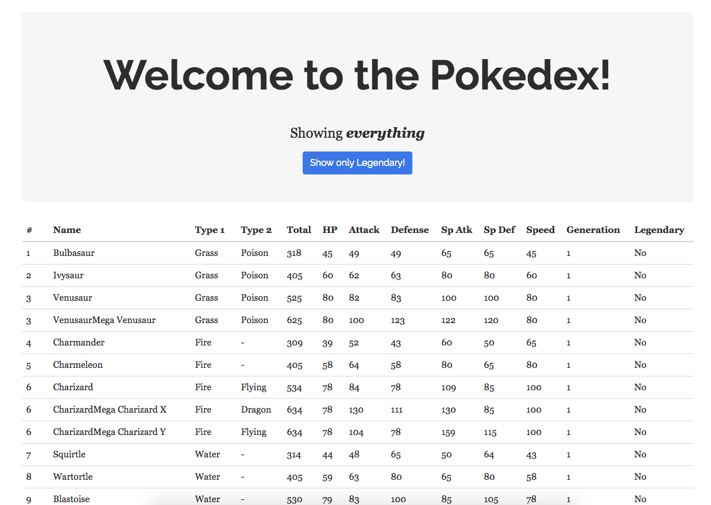
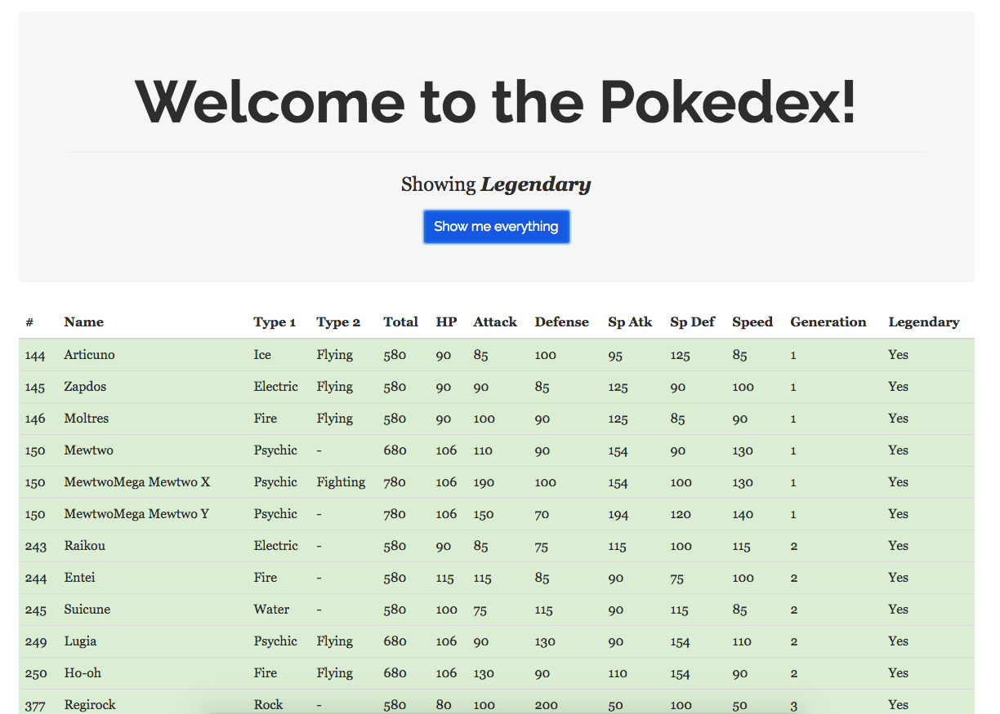

# pokedex

## Prerequisites

Have these installed:

- MongoDB
- NodeJS

## Build Setup

``` bash
# initialize DB and install dependencies across all projects
npm init

# serve backend at localhost:3000
npm run start:backend

# serve frontend at localhost:8080
npm run start:frontend
```

## Screenshots




